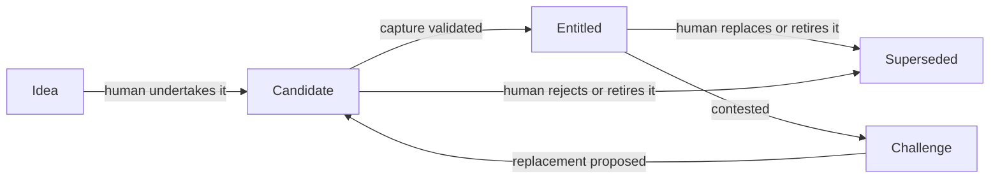

# The model

The graph captures statements a group is willing to rely on, along with why,
who recorded them, who validated the capture, and what depends on them. Its two
directions are **decisions producing documentation** and **documentation informing
later decisions**. Keeping each claim in a small structured record makes it
retrievable without searching whole transcripts.

## Commitments

An atom is the smallest useful independently reviewable claim. Its `value` is
structured data; its body explains context. Both describe the same position.

| Type | Test | Fictional example |
|---|---|---|
| `POLICY` | Can an actor inside the group follow or violate it? | Lend items for 14 days |
| `FACT` | Is it a claim about the world that can be true or false? | A shelf holds 40 items |
| `BOTH` | Does it describe a current assignment and prescribe responsibility? | A coordinator holds and performs a role |

Perspective matters: another group's promise is a fact your group relies on.
A proposal the group has not undertaken belongs in `ideas/`. An undertaken
commitment awaiting capture validation belongs in the main graph as a candidate.
An unanswered question belongs in `questions/`. An index or registry is a
`reference` atom and does not participate in the commitment lifecycle.

## Lifecycle and entitlement

**Candidate** means captured but not validated. **Entitled** means the required
human validators confirmed that the record accurately captures the source.
**Superseded** means historical, replaced, or retired. Capture validation does
not establish that a decision is wise, unanimously supported, or externally true.

An atom can explicitly name its required validators. Otherwise the source owner
validates it. Optional configured participant priority resolves ownerless indexed
sources. A configured fallback is available but disabled in the example. No owner
means no automatic promotion. This is a trust-based local workflow: names and
standing records document authority; they are not login credentials.

`accountable` names who carries the obligation. `authority` names who may revise
it. Standing records explain domain authority. These concepts are distinct from
capture validation. `entitlement.measurability` and `.consequence` describe how
to check a commitment and what follows from a violation; they are optional
descriptive fields, not additional approval gates.

`legibility_ceiling: true` is an explicit governance exception to approval checks.
Do not use it as a shortcut for missing approvals. Only an authorized human should
establish such an exception. Approval commands do not automatically promote it.

## Relationships

- `references`: background or supporting context.
- `licenses`: a directed enabling relationship, with reason and human proposer.
- `precludes`: a directed conflict, with reason and human proposer.
- `incompatible_with`: two commitments cannot both hold as entitled.
- `supersedes` / `superseded_by`: the revision chain.

Inference relationships must be articulated by a human. Agents may find possible
overlaps for review, but must not silently invent edges. The `validated` date
records confirmation of an edge. Edge weight is derived from endpoint lifecycle:
both entitled is `load-bearing`; any superseded is `historical`; otherwise it is
`provisional`. This label alone does not prove an edge is correct.

## Change and disagreement

A challenge keeps a contested point visible while evidence or alignment is
gathered. It has targets, a basis, success criteria, blockers, a deliberation log,
and an eventual resolution. Accepting a challenge can retire the old atom or
create a replacement candidate. Rejection reaffirms the old atom. Withdrawal is
recorded without changing the original commitment.

Ordinary unambiguous corrections can be edited directly. Reconcile the value,
title, body, and summaries together. Clear existing approvals and return to
candidate when the approved meaning changes. The starter documents this workflow;
it does not intercept every text-editor edit.

Expiration is a signal, not a decision. `valid_until` in the past adds an overdue
flag when reading the atom. It does not erase or supersede the commitment.
